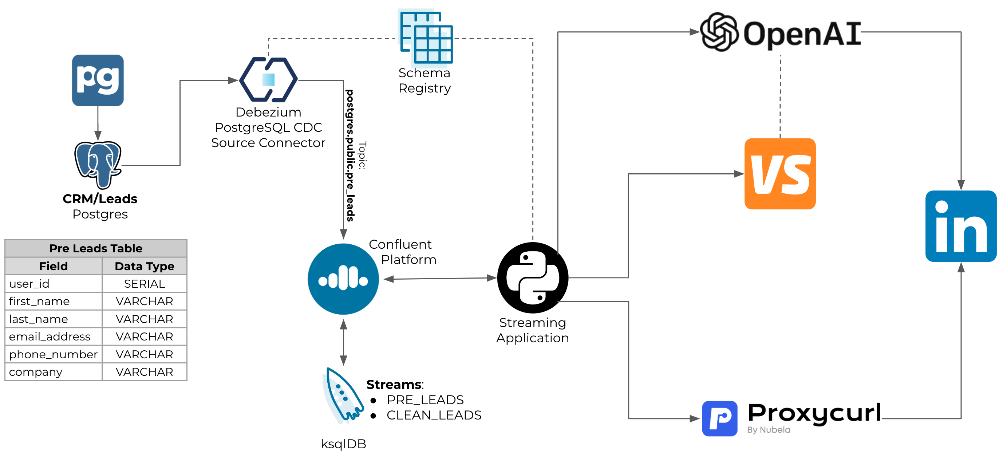
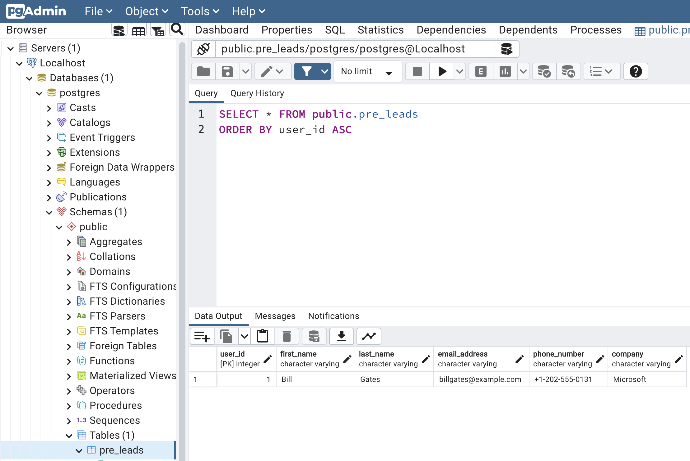

# Confluent and GenAI
This demo is based on https://github.com/ora0600/genai-with-confluent.

<table>
  <tr><th colspan="2">:speech_balloon: USE CASE</tr>
  <tr>
    <td>Leads are populated to a Database or CRM system manually or ideally through an automated process (like for example, visitors on your website), but most of the time they need to be enriched with additional content so it can be picked up by the business development team before touching base with them. Content such as a short professional summary, some interesting personal/professional facts and a couple of ice-breakers. This saves money, and adds value for the prospect and also increases the chances of success to connect with the lead and open up doors to do business with them.</td>
  </tr>
</table>

Demo is composed of:
* [PostgreSQL](https://www.postgresql.org/) database (to emulate our CRM system)
* [pgAdmin](https://www.pgadmin.org/) to access the PostgreSQL database and edit the leads table
* Data Streaming Platform ([Confluent Platform](https://docs.confluent.io/platform/current/platform.html))
* [Schema Registry](https://docs.confluent.io/platform/current/schema-registry/index.html)
* [Confluent Control Center](https://docs.confluent.io/platform/current/control-center/index.html)
* [ksqlDB](https://docs.confluent.io/platform/current/ksqldb/index.html) cluster to process the data received by the source connector
* [Connect cluster](https://docs.confluent.io/platform/current/connect/userguide.html)
* [Debezium PostgreSQL CDC Source Connector for Confluent Platform](https://docs.confluent.io/kafka-connectors/debezium-postgres-source/current/overview.html) to auto ingest the CRM table from the PostgreSQL database
* Streaming application in [Python](https://docs.confluent.io/platform/current/clients/confluent-kafka-python/html/index.html) to have the leads enriched with AI generated data

## Software Requirements
* [jq](https://jqlang.github.io/jq/)
* [curl](https://curl.se/)
* [Docker Desktop](https://www.docker.com/products/docker-desktop/)
* [Python 3.8+](https://www.python.org/)

### Python libs and virtual environment
* Clone this repo: `git clone git@github.com:ifnesi/cp-genai-demo.git`
* Go to the demo folder: `cd cp-genai-demo`
* Create a Python virtual environment: `python3 -m venv .venv`
* Activate the Python virtual environment: `source .venv/bin/activate`
* Install the python requirements: `python3 -m pip install -r requirements.txt`
* Deactivate the Python virtual environment: `deactivate`

### Generative AI API keys required
This demo uses [Python's Langchain framework](https://python.langchain.com/docs/get_started/introduction) to interact with the [OpenAI](https://openai.com/) API.

To be able to interact with the APIs, you will need the following API keys:
* [OpenAI](https://openai.com/) LLM model
  - Follow steps from [here](https://platform.openai.com/docs/quickstart/account-setup) to create an Account and then an API Key only
* [Value SERP API](https://get.valueserp.com/try-it-free) to find the LinkedIn profile URL
  - Click on the button `Try it free` and created your account
* [ProxyCurl](https://nubela.co/proxycurl/) to query the leads professional profile on LinkedIn
  - Follow [these steps](https://nubela.co/proxycurl). You get 10 free credit, it is more than enough for a simple demo

<table>
  <tr><th colspan="2">:warning: IMPORTANT</th></tr>
  <tr>
    <td>Unfortunately the APIs are not for free, but with less than USD$ 10 ou can run this demo.</td>
  </tr>
</table>

Having the API keys at hand, create a file named `.env_api_keys` file by executing the command:
```bash
cat > .env_api_keys <<EOF
export OPENAI_API_KEY=<openAI_Key_here>
export PROXYCURL_API_KEY=<ProxyURL_Key_here>
export SERPAPI_API_KEY=<SERP_Key_here>
EOF
```

You are now ready to start the demo!

### Demo Diagram and how it works


To understand how this demo works, let's go through step-by-step on what happens:
1. When the demo starts (see [here](#running-the-demo) how to), it will provision the elements required:
- PostgreSQL: Table created `public.pre_leads` with the following fields `user_id`, `first_name`, `last_name`, `email_address`, `phone_number`, `company`
- pgAdmin: http://localhost:5050 (username: `admin@admin.org`, password: `admin`)
- Confluent Platform: localhost:9094
- Confluent Control Center: http://localhost:9021
- Schema Registry: http://localhost:8081
- Connect cluster + Debezium PostgreSQL CDC Source Connector: : http://localhost:8083
- ksqlDB cluster: http://localhost:8088/info
2. The python script `provision_db.py` will create the table `public.pre_leads` into the PostgreSQL database and insert the following row:
```
INSERT INTO public.pre_leads (first_name, last_name, company, email_address, phone_number) VALUES ('Bill', 'Gates', 'Microsoft', 'billgates@example.com', '+1-202-555-0131');
```
3. You can access pgAdmin and inspect the data:

4. The PostgreSQL Source Connector will be configured to CDC to Confluent Platform the table `public.pre_leads`. In that moment the following message will be published through the connector to the Kafka topic `postgres.public.pre_leads` Avro serialised. See example below (remember, this is in the PostgreSQL Debezium format)
```
{
  "before": null,
  "after": {
    "postgres.public.pre_leads.Value": {
      "user_id": 1,
      "first_name": {
        "string": "Bill"
      },
      "last_name": {
        "string": "Gates"
      },
      "email_address": {
        "string": "billgates@example.com"
      },
      "phone_number": {
        "string": "+1-202-555-0131"
      },
      "company": {
        "string": "Microsoft"
      }
    }
  },
  "source": {
    "version": "2.2.1.Final",
    "connector": "postgresql",
    "name": "postgres",
    "ts_ms": 1706276555814,
    "snapshot": {
      "string": "false"
    },
    "db": "postgres",
    "sequence": {
      "string": "[\"25646488\",\"25646592\"]"
    },
    "schema": "public",
    "table": "pre_leads",
    "txId": {
      "long": 737
    },
    "lsn": {
      "long": 25646592
    },
    "xmin": null
  },
  "op": "c",
  "ts_ms": {
    "long": 1706276556375
  },
  "transaction": null
}
```
5. We could use that topic as is, however if, for example, in the future we change our CRM system we would need to adjust all downstream applications for a possible new data structure. For that reason, we need to create a **Data Product** to be able to decouple the CRM to the downstream applications. In case of any change in the CRM we only need to adjust that layer. To do so we will use ksqlDB.
- First we need to ingest the topic `postgres.public.pre_leads`. The following is the ksqlDB Stream created:
```
CREATE STREAM PRE_LEADS WITH (kafka_topic='postgres.public.pre_leads', value_format='AVRO');
```
- Then, we need to clean it up and output the result to the topic `clean_leads` also Avro serialised:
```
CREATE STREAM CLEAN_LEADS WITH (kafka_topic='clean_leads', value_format='AVRO') AS SELECT AFTER->USER_ID, AFTER->FIRST_NAME, AFTER->LAST_NAME, AFTER->COMPANY, AFTER->EMAIL_ADDRESS, AFTER->PHONE_NUMBER FROM PRE_LEADS WHERE OP='c';
```
6. Now that we have the data we need in a format we can assure the downstream applications it will not change (or if done so in a way we have total control of), our streaming application (python script `streaming-app-genai.py`) kicks in. It will be consuming the topic `clean_leads`, for example:
```
{
  "USER_ID": 1,
  "FIRST_NAME": "Bill",
  "LAST_NAME": "Gates",
  "COMPANY": "Microsoft",
  "EMAIL_ADDRESS": "billgates@example.com",
  "PHONE_NUMBER": "+1-202-555-0131"
}
```
7. Upon consuming that topic it will get the FIRST_NAME, LAST_NAME and COMPANY to get from LinkedIn the profile URL. For that it will use OpenAI and ProxyCurl. The following is the prompt submitted to OpenAI's LLM:
```
Given the name '<FIRST_NAME LAST_NAME COMPANY>' get the link to their Linkedin profile. Your answer should only contain the URL
```
8. OpenAI's LLM and ProxyCurl will do their magic and, for that case, return `https://www.linkedin.com/in/williamhgates`.
9. Having the profile URL we can then get the **public** profile data from LinkedIn using ProxyCurl.
10. The data we get from LinkedIn is what we need to enrich the prompt when submitting the second request to OpenAI. The prompt is the following:
```
Given the Linkedin information '<linkedin_public_profile_data>' about a person from I want you to create a JSON response with the following structure:,
1. Key: A short summary, Value: String formatted
2. Key: Latest position, job title, company and a brief summary, Value: String formatted
3. Key: Two interesting facts about them, Value: Array of strings
4. Key: A topic that may interest them, Value: String formatted
5. Key: Two creative Ice breakers to open a conversation with them, Value: Array of strings
```
11. The response we will get from OpenAI might vary, but here is one example:
```
{
  "summary": "Co-chair of the Bill & Melinda Gates Foundation. Founder of Breakthrough Energy. Co-founder of Microsoft. Voracious reader. Avid traveler. Active blogger.",
  "latest_position": {
    "job_title": "Co-chair",
    "company": "Bill & Melinda Gates Foundation",
    "summary": "Co-chair of the Bill & Melinda Gates Foundation. Leading philanthropic efforts to improve global healthcare, education, and access to technology."
  },
  "interesting_facts": [
    "Bill Gates is the co-founder of Microsoft, one of the world's largest technology companies.",
    "He is known for his voracious reading habits and is an avid traveler."
  ],
  "topic_of_interest": "Global healthcare and education",
  "ice_breakers": [
    "What book have you read recently that has left a lasting impact on you?",
    "Have you visited any interesting places during your travels?"
  ]
}
```
12. Upon reciving that information the streaming application will publish to the kafka topic `clean_leads_enriched` (Avro serialised) the data from the lead added with the summary, for example:
```
{
  "user_id": 1,
  "first_name": "Bill",
  "last_name": "Gates",
  "company": "Microsoft",
  "email_address": "billgates@example.com",
  "phone_number": "+1-202-555-0131",
  "linkedin_profile_url": "The link to Bill Gates' Linkedin profile is https://www.linkedin.com/in/williamhgates",
  "context": "{\"summary\": \"Co-chair of the Bill & Melinda Gates Foundation. Founder of Breakthrough Energy. Co-founder of Microsoft. Voracious reader. Avid traveler. Active blogger.\", \"latest_position\": {\"job_title\": \"Co-chair\", \"company\": \"Bill & Melinda Gates Foundation\", \"summary\": \"Co-chair of the Bill & Melinda Gates Foundation. Leading philanthropic efforts to improve global healthcare, education, and access to technology.\"}, \"interesting_facts\": [\"Bill Gates is the co-founder of Microsoft, one of the world\'s largest technology companies.\", \"He is known for his voracious reading habits and is an avid traveler.\"], \"topic_of_interest\": \"Global healthcare and education\", \"ice_breakers\": [\"What book have you read recently that has left a lasting impact on you?\", \"Have you visited any interesting places during your travels?\"]}"'
}
```
13. If you want to generate a new lead (which will trigger the how data streaming flow), access pgAdmin and add a new row to the table `pre_leads`. Please notice although the CDC connector will publish to the Kafka topic `postgres.public.pre_leads` upon create, update and delete, the ksqlDB stream `CLEAN_LEADS` was designed to only consider inserts (notice the filter `WHERE OP='c'`). For details about the event value fields for that connector please refer to their [documentation](https://debezium.io/documentation/reference/stable/connectors/postgresql.html).

## Running the demo
To run the demo, start docker desktop then run `./demo.sh --start`, it should take less than 2 minutes to have everything up and running, by default it will look Bill Gate up and get his summary from LinkedIn, but before you try to cold call him both email and phone number are no the real ones, so please don't try!

Usage:
```
usage: ./demo.sh [-h, --help] [-x, --start] [-p, --stop]

Confluent and GenAI Demo

Options:
 -h, --help    Show this help message and exit
 -x, --start   Start demo
 -p, --stop    Stop demo
```

Output example:
```
2024-01-26 10:00:10.000 [INFO]: Activating virtual environment
2024-01-26 10:00:11.000 [INFO]: Setting environment variables
2024-01-26 10:00:11.000 [INFO]: Starting docker compose
[+] Running 10/10
 ✔ Network genai-demo_default  Created
 ✔ Container zookeeper         Started
 ✔ Container postgres          Started
 ✔ Container broker            Started
 ✔ Container pgadmin           Started
 ✔ Container ksqldb-server     Started
 ✔ Container schema-registry   Started
 ✔ Container connect           Started
 ✔ Container control-center    Started
 ✔ Container ksqldb-cli        Started

2024-01-26 10:00:14.000 [INFO]: Waiting Schema Registry to be ready.............
2024-01-26 10:00:28.000 [INFO]: Waiting Connect Cluster to be ready.............
2024-01-26 10:00:41.000 [INFO]: Waiting ksqlDB Cluster to be ready
2024-01-26 10:00:41.000 [INFO]: Waiting Confluent Control Center to be ready
2024-01-26 10:00:41.000 [INFO]: Creating Postgres CDC Source connector (postgres_cdc_source_0)
  % Total    % Received % Xferd  Average Speed   Time    Time     Time  Current
                                 Dload  Upload   Total   Spent    Left  Speed
100  1026  100   458  100   568   1463   1815 --:--:-- --:--:-- --:--:--  3288

2024-01-26 10:00:44.000 [INFO]: Status PostgreSQL CDC Source connector (postgres_cdc_source_0)
{
  "name": "postgres_cdc_source_0",
  "connector": {
    "state": "RUNNING",
    "worker_id": "connect:8083"
  },
  "tasks": [
    {
      "id": 0,
      "state": "RUNNING",
      "worker_id": "connect:8083"
    }
  ],
  "type": "source"
}

2024-01-26 10:00:46.000 [INFO]: Demo environment is ready!
2024-01-26 10:00:46.768 [INFO]: Table created successfully!
2024-01-26 10:00:46.784 [INFO]: Initial lead successfuly created!
2024-01-26 10:00:47.000 [INFO]: Waiting for topic 'postgres.public.pre_leads' to be created
2024-01-26 10:00:48.000 [INFO]: Creating ksqlDB STREAMS

CREATE STREAM PRE_LEADS WITH (kafka_topic='postgres.public.pre_leads', value_format='AVRO');
[
  {
    "@type": "currentStatus",
    "statementText": "CREATE STREAM PRE_LEADS (BEFORE STRUCT<USER_ID INTEGER, FIRST_NAME STRING, LAST_NAME STRING, EMAIL_ADDRESS STRING, PHONE_NUMBER STRING, COMPANY STRING>, AFTER STRUCT<USER_ID INTEGER, FIRST_NAME STRING, LAST_NAME STRING, EMAIL_ADDRESS STRING, PHONE_NUMBER STRING, COMPANY STRING>, SOURCE STRUCT<VERSION STRING, `CONNECTOR` STRING, NAME STRING, TS_MS BIGINT, SNAPSHOT STRING, DB STRING, SEQUENCE STRING, SCHEMA STRING, `TABLE` STRING, TXID BIGINT, LSN BIGINT, XMIN BIGINT>, OP STRING, TS_MS BIGINT, TRANSACTION STRUCT<ID STRING, TOTAL_ORDER BIGINT, DATA_COLLECTION_ORDER BIGINT>) WITH (CLEANUP_POLICY='delete', KAFKA_TOPIC='postgres.public.pre_leads', KEY_FORMAT='KAFKA', VALUE_FORMAT='AVRO');",
    "commandId": "stream/`PRE_LEADS`/create",
    "commandStatus": {
      "status": "SUCCESS",
      "message": "Stream created",
      "queryId": null
    },
    "commandSequenceNumber": 2,
    "warnings": []
  }
]

CREATE STREAM CLEAN_LEADS WITH (kafka_topic='clean_leads', value_format='AVRO') AS SELECT AFTER->USER_ID, AFTER->FIRST_NAME, AFTER->LAST_NAME, AFTER->COMPANY, AFTER->EMAIL_ADDRESS, AFTER->PHONE_NUMBER FROM PRE_LEADS WHERE OP='c';
[
  {
    "@type": "currentStatus",
    "statementText": "CREATE STREAM CLEAN_LEADS WITH (CLEANUP_POLICY='delete', KAFKA_TOPIC='clean_leads', PARTITIONS=1, REPLICAS=1, RETENTION_MS=604800000, VALUE_FORMAT='AVRO') AS SELECT\n PRE_LEADS.AFTER->USER_ID USER_ID,\n PRE_LEADS.AFTER->FIRST_NAME FIRST_NAME,\n PRE_LEADS.AFTER->LAST_NAME LAST_NAME,\n PRE_LEADS.AFTER->COMPANY COMPANY,\n PRE_LEADS.AFTER->EMAIL_ADDRESS EMAIL_ADDRESS,\n PRE_LEADS.AFTER->PHONE_NUMBER PHONE_NUMBER\nFROM PRE_LEADS PRE_LEADS\nWHERE (PRE_LEADS.OP = 'c')\nEMIT CHANGES;",
    "commandId": "stream/`CLEAN_LEADS`/create",
    "commandStatus": {
      "status": "SUCCESS",
      "message": "Created query with ID CSAS_CLEAN_LEADS_3",
      "queryId": "CSAS_CLEAN_LEADS_3"
    },
    "commandSequenceNumber": 4,
    "warnings": []
  }
]

2024-01-26 10:00:50.000 [INFO]: Starting GenAI streaming application
2024-01-26 10:00:52.240 [INFO]: Started consumer demo-genai-01 (demo-genai) on topic 'clean_leads'
2024-01-26 10:00:52.397 [INFO]: New message received: {"USER_ID": 1, "FIRST_NAME": "Bill", "LAST_NAME": "Gates", "COMPANY": "Microsoft", "EMAIL_ADDRESS": "billgates@outlook.com", "PHONE_NUMBER": "+155548100000"}
2024-01-26 10:00:52.397 [INFO]: Search for information: Bill Gates Microsoft with genAI!

> Entering new AgentExecutor chain...
2024-01-26 10:00:54.432 [INFO]: HTTP Request: POST https://api.openai.com/v1/chat/completions "HTTP/1.1 200 OK"
I need to find the Linkedin profile page of Bill Gates from Microsoft.
Action: Crawl Google 4 linkedin profile page
Action Input: "Bill Gates Microsoft Linkedin"
Observation: https://www.linkedin.com/in/williamhgates
Thought:2024-01-26 10:00:57.349 [INFO]: HTTP Request: POST https://api.openai.com/v1/chat/completions "HTTP/1.1 200 OK"
I have found the Linkedin profile page of Bill Gates from Microsoft.
Final Answer: https://www.linkedin.com/in/williamhgates

> Finished chain.
2024-01-26 10:00:57.351 [INFO]: LinkedIn profile URL: https://www.linkedin.com/in/williamhgates
2024-01-26 10:01:34.220 [INFO]: HTTP Request: POST https://api.openai.com/v1/chat/completions "HTTP/1.1 200 OK"
2024-01-26 10:01:34.224 [INFO]: {
  "summary": "Co-chair of the Bill & Melinda Gates Foundation. Founder of Breakthrough Energy. Co-founder of Microsoft. Voracious reader. Avid traveler. Active blogger.",
  "latest_position": {
    "job_title": "Co-chair",
    "company": "Bill & Melinda Gates Foundation",
    "summary": "Co-chair of the Bill & Melinda Gates Foundation. Leading philanthropic efforts to improve global healthcare, education, and access to technology."
  },
  "interesting_facts": [
    "Bill Gates is the co-founder of Microsoft, one of the world's largest technology companies.",
    "He is known for his voracious reading habits and is an avid traveler."
  ],
  "topic_of_interest": "Global healthcare and education",
  "ice_breakers": [
    "What book have you read recently that has left a lasting impact on you?",
    "Have you visited any interesting places during your travels?"
  ]
}
2024-01-26 10:01:34.224 [INFO]: Producing enriched lead to topic: clean_leads_enriched
2024-01-26 10:01:35.361 [INFO]: <Callback> Message successfully produced to Topic 'clean_leads_enriched': Key = 1, Partition = 0, Offset = None
^C2024-01-26 10:02:51.659 [WARNING]: CTRL-C pressed by user!
2024-01-26 10:02:51.659 [INFO]: Closing consumer demo-genai-01 (demo-genai)
```

## Stopping the demo
To stop the demo, please run `./demo.sh --stop`.
```
2024-01-26 10:03:31.000 [INFO]: Stopping docker compose
[+] Running 10/9
 ✔ Container ksqldb-cli        Removed
 ✔ Container connect           Removed
 ✔ Container control-center    Removed
 ✔ Container pgadmin           Removed
 ✔ Container ksqldb-server     Removed
 ✔ Container postgres          Removed
 ✔ Container schema-registry   Removed
 ✔ Container broker            Removed
 ✔ Container zookeeper         Removed
 ✔ Network genai-demo_default  Removed  
```

## External References
Check out [Confluent's Developer portal](https://developer.confluent.io), it has free courses, documents, articles, blogs, podcasts and so many more content to get you up and running with a fully managed Apache Kafka service.

Disclaimer: I work for Confluent :wink:
